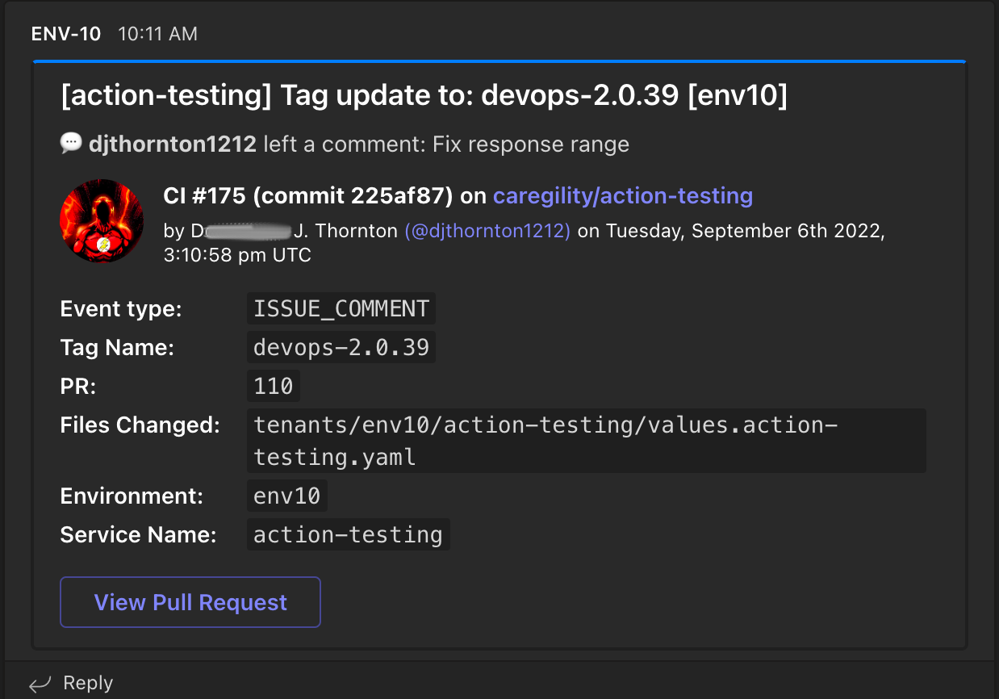
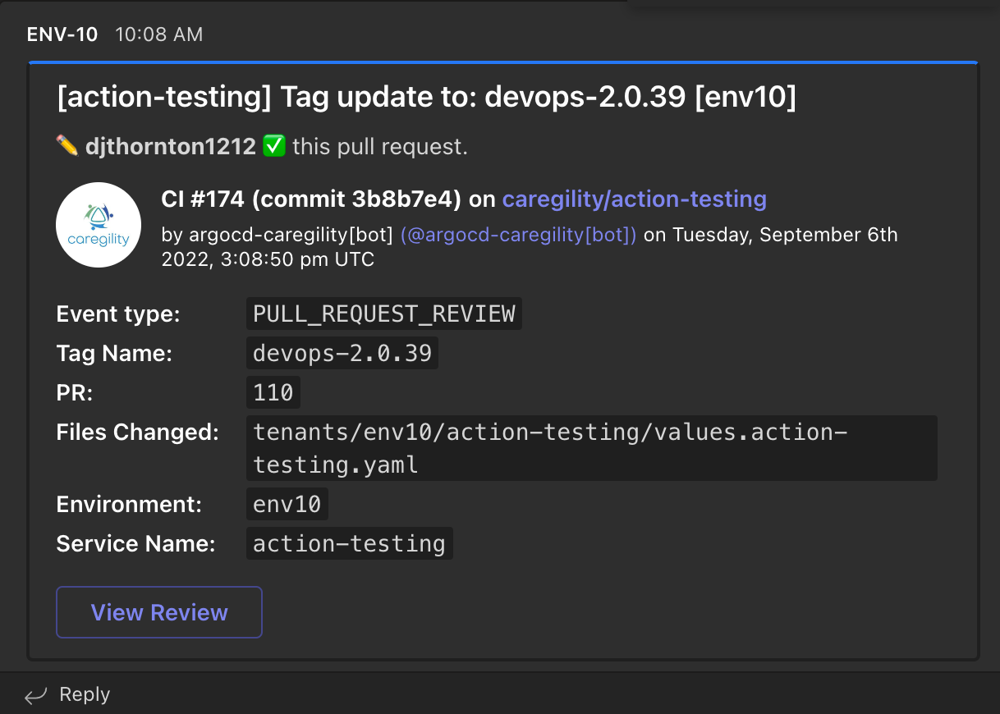

# Microsoft Teams Notification

A GitHub Action that sends customizable notifications to a dedicated Microsoft Teams channel.

All credit to **[jdcargile](https://github.com/jdcargile/ms-teams-notification)** the original creator of this action.

## Table of Contents

1. [Usage](#usage)
1. [Examples](#examples)
1. [Emojis](#emojis)
1. [View Pull Requests & Reviews](#view-pull-request-and-review)

## Usage

1. Add `MS_TEAMS_WEBHOOK_URI` on your repository's configs on Settings > Secrets. It is the [Webhook URI](https://docs.microsoft.com/en-us/microsoftteams/platform/webhooks-and-connectors/how-to/add-incoming-webhook) of the dedicated Microsoft Teams channel for notification.

1. Add a new `step` on your workflow code below `actions/checkout@v2`:

    ```yaml
    name: MS Teams Notification

    on: [push, pull_request]

    jobs:
      build:
        runs-on: ubuntu-latest

        steps:
          - uses: actions/checkout@v2
          # this is the new step using the ms-teams-notification action
          - name: Notify dedicated teams channel
            uses: djthornton1212/ms-teams-notification@v1.3
            with:
              custom-facts: 
                - name: Fact 1
                  value: The fact to communicate
                - name: Fact 2
                  value: The next fact to communicate
                - name: ...
                  value: ...
              description: Text description to be communicated under titile
              github-token: ${{ github.token }} # will use the runner's token.
              ms-teams-webhook-uri: ${{ secrets.MS_TEAMS_WEBHOOK_URI }}
              notification-summary: Your custom notification message 
              notification-color: 17a2b8
              timezone: America/Denver
              view-commit-changes: true 
              view-pull-request: true
              view-workflow-run: true
    ```

1. Make it your own with the following configurations.
    - `custom-facts:` - **(optional)** A yaml list of facts to be added to the card. Credit to [toko-bifrost/ms-teams-deploy-card](https://github.com/toko-bifrost/ms-teams-deploy-card)
    - `description:` - **(optional)** Text to describe the card.
    - `github-token:` - **(required)**, set to the following:
      - `${{ github.token }}`
    - `ms-teams-webhook-uri:` - **(required)**, setup a new secret to store your Microsoft Teams Webhook URI (ex. `MS_TEAMS_WEBHOOK_URI`). Learn more about setting up [GitHub Secrets](https://help.github.com/en/actions/configuring-and-managing-workflows/creating-and-storing-encrypted-secrets) or [Microsoft Teams Incoming Webhook](https://docs.microsoft.com/en-us/microsoftteams/platform/webhooks-and-connectors/how-to/add-incoming-webhook).
    - `notification-summary:` **(required)**, Your custom notification message (ex. Deployment Started or Build Successful)
    - `notification-color:` **(optional)**, Custom color to help distinguish type of notification. Can be any [HEX color](https://html-color.codes/). (ex. **007bff** or **17a2b8** for info, **28a745** success, **ffc107** warning, **dc3545** error, etc.)
    - `timezone:` - **(optional)** Defaults to `UTC`), a [valid database timezone name](https://en.wikipedia.org/wiki/List_of_tz_database_time_zones), (ex. Australia/Sydney or America/Denver, etc.)
    - `view-commit-changes:` **(optional)** Activates `view commit changes` button on card.
    - `view-pull-request:` **(optional)** Activates `view pull request` button on card.
    - `view-workflow-run:` **(optional)** Activates `view workflow run` button on card.

## Examples

As you can see below, the `notification-summary` and `notification-color` are being used to customize the appearance of the message. Use bright vibrant colors to notify your Microsoft Teams channel of warnings, errors or notices in your GitHub Actions workflow.


### Emojis

Emoji support isn't great for incoming webhooks on Microsoft Teams yet. You can hack your way through it using HEX codes. For example, in `notification-summary` I used `Emojify! &#x1F6A2​​ &#x2705;` for the following screenshot. HEX codes for emojis [here](https://apps.timwhitlock.info/emoji/tables/unicode).


### View Pull Request and Review

Below is a screenshot with the `view-pull-request` active for both a pull and a code review & facts active:




